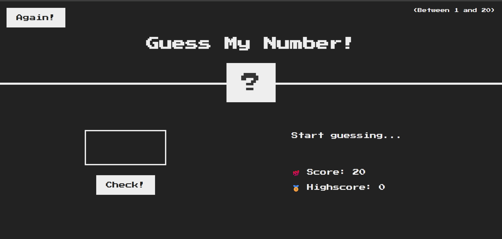

# 🎯 Guess My Number Game

A fun and interactive number guessing game built using HTML, CSS, and JavaScript.

---

## 📸 Demo Screenshot

---

## 🚀 Features

- 🔢 Random secret number between 1 and 20
- 🎯 Score and high score tracking
- ✅ Win/Lose logic
- ♻️ Reset functionality
- 💡 Simple and clean UI

---

## 🛠️ Technologies Used

- ✅ HTML
- 🎨 CSS
- ⚙️ JavaScript

---

## 🔗 Live Demo

👉 [Try the Game](https://subodh2708.github.io/Guess-my-number/)

---

## 🧠 How to Use

1. Enter a number between 1 and 20.
2. Click "Check" to see if it's the secret number.
3. Your score decreases with each wrong guess.
4. Click "Again!" to reset the game.

---

## 🙌 Author

Made with ❤️ by [Subodh Singh](https://github.com/subodh2708)
